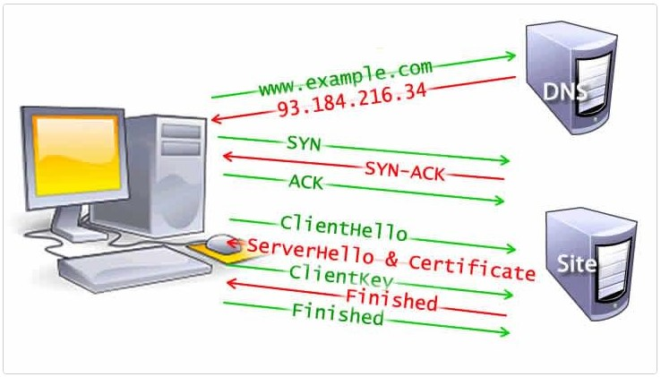
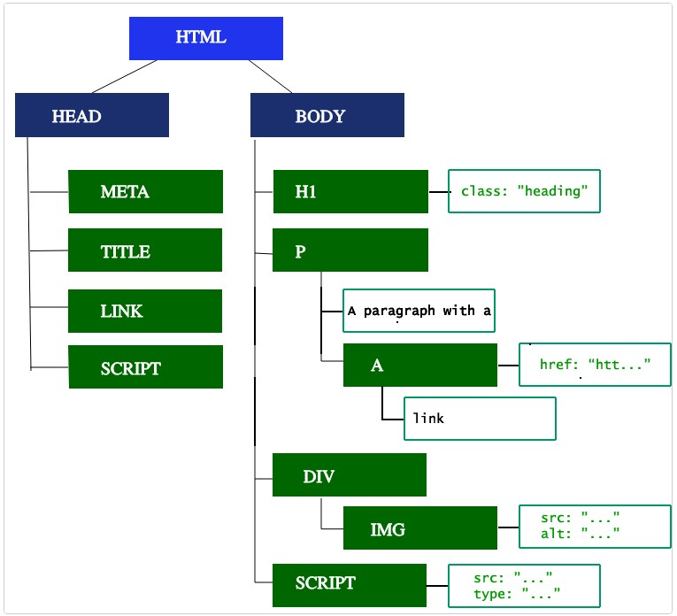
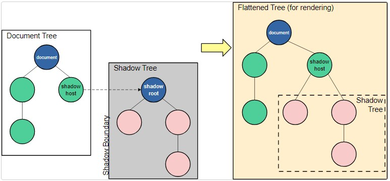

# Front-end

Front-end development is resposable to create user interfaces of a website, working close to back-end developers to ensure the communication between web application and server, also works with designers and product managers to ensure a good usability and a product that attends the client's demands.

## How the browser works

### Navigation

The first step when loading a web page, occurs when an user request a page by entering a URL into the address bar, clicking a link or submiting a form.

#### DNS Lookup

Thw first step is your browser make a requests for a DNS lookup, with us fuekded by a name server and return a response with an IP address. After this requests, the IP will be cached for a type. The DNS lookups ussually only need to be done once per hostname for a page Load.

#### TCP Handshake

Once we know the IP address, the browser set up a connection via TCP three-way handshake. So that way the browser and the web server can communicate.

#### TLS Negotiation (HTTPS)

This handshake determines which cypher will be user to encrypt the communications, verifies the server, and establishes that a secure connection is in place before beginning the actual transfer of data.



### Response

Once the connection is established, the browser sends the an initial HTTP (Get) request on behalf of the user. Once the server receives the requests, it will reply with relevant response headers and the contents of the HTML.

### Parsing

Is the step the browser takes to turn the data ir receives into the DOM and CSSOM, whi is used by the renderer to paint a page to the screen.
The DOM is the internal representation of the markup for the browser, and can be exposed and manipulated through varios APIs in javascript.

#### Building the DOM tree

The first step is processing the HTML markup and building the DOM tree. The DOM tree describes the content of the document.
When the parses finds non-blocking resources, such as an image, the browser will request those resources and continue parsing.
Parsing can continue when a CSS file is encountered, but `<script>` elements, particular those without `async` of `defer` attribute, block rendering and pause parsing of HTML.



#### Preload scanner

While browsers parses the DOM tree, and occupies the main thread, the preload scanner is responsable to parse the content available and request high-priority resources like CSS, JS and web fonts.

```html
<link rel="stylesheet" href="styles.css" />
<script src="myscript.js" async></script>

<script src="anotherscript.js" async></script>
```

Waiting to obtain CSS doesn't block HTML parsing or downloading, but it does block JavaScript because JavaScript is often used to query CSS properties' impact on elements.

#### Building the CSSOM tree

The second step is responsable to process the CSS and builds the CSSDOM tree. very simillar to the DOM tree.

#### Javascript compilation

While CSSDOM is being builded, the javascript and other assets are being downloaded, thanks to preload scanner.
Javascript is parsed, compiled and interpreted. Most of the code is interpreted on the main thread.

#### Building the acessibility three

The browser also builds an accessibility treee that assist devices use to parse and interpret content. The AOM is like the DOM.

Until the AOM is build, the content is not acessible to screen readers.

### Render

#### Style

The third step is combining the DOM and CSSOM into a render tree.

Each visible node has its CSSOM rules applied to it. The render tree holds all the visible nodes with content and computed styles — matching up all the relevant styles to every visible node in the DOM tree, and determining, based on the CSS cascade, what the computed styles are for each node.

#### Layout

The fourth step is running layout on the render tree to compute the geometry of each node. The first time the size and position of each node is determined is called _layout_. Subsequent recalculations are called _reflows_.

#### Paint

The last step is paiting the individual nodes to the screen. Painting can break the elements in the layout tree into layers.
Layers do improve performance but are expensive when it comes to memory management, so should not be overused as part of web performance optimization strategies.

#### Compositing

When sections of the document are drawn in different layers, overlapping each other, compositing is necessary to ensure they are drawn to the screen in the right order and the content is rendered correctly.

### Interactivity

If loads includes JS, that was correctly deferred, and only executed after onload event fires, the main thread might be busy, and not available to scrolling, touch and other interactions.

## REST Principles

Representation State Transfer is a group of software architecture that bring efficient, reliable and scalable systems.

To an API be considered RESTful, must be:

- Server/Client with http requests
- Stateless comunication between client/server, requests are splitted and desconected
- Store data in cache to optmize
- Informations must have a standart format.
- A system with layers that organizze types of servers.

## Web components

Suite of technologies that allows to create reusable custom elements. encapsulating away from the rest of the code.

https://developer.mozilla.org/en-US/docs/Web/API/Web_components

### Custom elements

Set of Javascript API that allows to define custom elements and behavior.

#### Types

- Customized built-in elements, from standart HTML like `HTMLImageElement` of `HTMLParagraphElement`.
- Autonomous custom elements, from the base `HTMLElement`. We can implement from scratch.

#### Example of custom element

```js
class MyCustomElement extends HTMLElement {
  static observedAttributes = ["color", "size"];

  constructor() {
    // Always call super first in constructor
    super();
  }

  connectedCallback() {
    console.log("Custom element added to page.");
  }

  disconnectedCallback() {
    console.log("Custom element removed from page.");
  }

  adoptedCallback() {
    console.log("Custom element moved to new page.");
  }

  attributeChangedCallback(name, oldValue, newValue) {
    console.log(`Attribute ${name} has changed.`);
  }
}

customElements.define("my-custom-element", MyCustomElement);
```

### Shadow-dom

Set of Javascript API to attach and encapsulate shadow DOM tree to an element. This is rendered separately to the main DOM



#### Example

A `<video>` element, with the default browser controls exposed. All you see in the DOM is the `<video>` element, but it contains a series of buttons and other controls inside its shadow DOM. The shadow DOM spec enables you to manipulate the shadow DOM of your own custom elements.

#### "mode" Option

When, we pass an argument { mode: "open" } to attachShadow(). With mode set to "open", the JavaScript in the page is able to access the internals of your shadow DOM through the shadowRoot property of the shadow host.

#### Shadow-dom and custom elements

- Without the encapsulation provided by shadow DOM, custom elements would be impossibly fragile. It would be too easy for a page to accidentally break a custom element's behavior or layout by running some page JavaScript or CSS.
- Typically, the custom element itself is a shadow host, and the element creates multiple elements under that root, to provide the internal implementation of the element.

## SEO

SEO is a proccess of making a website more visible to search engines, inproving the search ranking.

SEO methods:

#### Technical

Semantic HTML, crawlers should only find the content you want indexed.

#### Copywriting

Write content in users language, use texts and images.

#### Popularity

Be linked by other established websites.

## SPA

Single Page Application are webpages that are loaded in the first page interaction. Sometimes that doesn't mean that a page has a single chunk, the page can still be divided in many chunks.

#### Advantages

- Its fast because the code is already loaded and removes the necessities to load more code.
- Mature libs like, angular, react and vuejs
- Less requests to the server to load more code

#### Disadvantages

- Impredictable performance
- hard SEO, you need to load the JS to make the requests, so you dont have all the content to search engines indexes.

## SSR

Server Side Rendering came to solve the few problems of SPA's. This method revert the process of rendering a page, bringing the render efforts to the server.

#### Advantages

- Better SEO, It's possible to define the content to be rendered in the server, you can choose the content that ill help the search engines indexes.
- Lower requirement to users, the render efforts is in the server.
- Better performance

#### Disadvantages

- The time to first byte in SSR application is bigger, because the server need to preload the content to give the response. While the TTFB doesnt happen, the users needs to see a loading.

## Micro frontends pros and cons

## Accessibility

## Web Security Knowledge

Protective measures taken by developers to protect web applications from threats.

### CORS

Cross-Origin Resource Sharing it's a mechanism that allows a website on one url to request data from a diferent url.

#### Success

1. Browser makes a requests,
2. It adds an origin header to the request message
3. If that request goest to a server on the same origin then it's allowed by the browser with no questions ask.

#### Failure

However if that requests goes to a diferent url, then it's known as a cross origin request.

1. When sending the response the server will add the access control allow origin header
2. It's value need to match the origin header on the request, or can be a wild card which allows any url to make the request
3. If it's a mismatch though the browser will prevent the response from being shared with the client

#### Solution

The solution is on the server, configuring the response with the proper header

express.js example

```js
app.use(cors({ origin: "http://foo.com" }));
```

### HTTPS

### XSS

Is a security exploit which allows an attacker to inject into a website malicious client-side code. The injected code is executed by the victims and lets the attackers bypass access controls and impersonate users.

### Content Security Policy

### OWASP Security Risks
