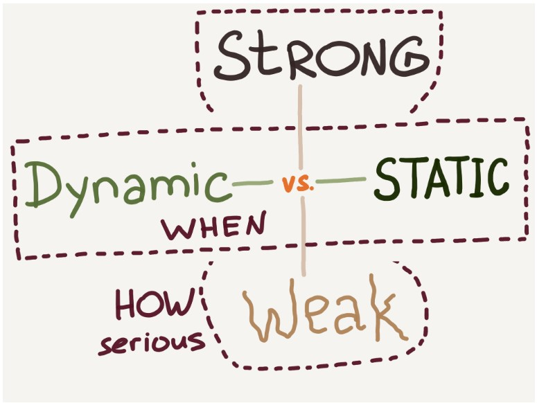

# Javascript

Javascript is a high-level, interpreted, lightweight, multi-paradigm and dynamic weak typing. It is most know as a scripting language for the web, but thanks to the runtime environment node, can algo be used on servers.

## Event loop

The event loop is resposable to execute the code. Collecting and processing events.

Priorities:

- Call stack
- Microtask
- Tasks

```js
console.log(1);
// Blocking operation
// Call stack

queueMicrotask(() => {
  // Non-blocking operation
  // Web api
  // Microtask
  console.log(2);
});

setTimeout(() => {
  // Non-blocking operation
  // Web api
  // Task
  console.log(3);
}, 0);

console.log(4);
// Blocking operation
// Call stack

Promise.resolve(true).then(() => {
  // Non-blocking operation
  // Web api
  // Microtask
  console.log(5);
});

///14253
```

## Multiparadigm

That means that javascript can be used in diferents paradigms of programming, like object-oriented, imperative and declarative (functional).

## Dynamic weak typing

Dynamic typed languages check the types and look for type errors during runtime. and statically typed languages do this in compile time.

Weak typing means that JS has notion of types, but it's relaxed about them, and can treat values somewhat arbitrary. The stronger the typing system is, the stricter the rules are.



## Promises

A Promise is an _object_ representing the eventual completion or failure of an asynchronous operation.

```js
function successCallback(result) {
  console.log(`Audio file ready at URL: ${result}`);
}

function failureCallback(error) {
  console.error(`Error generating audio file: ${error}`);
}

createAudioFileAsync(audioSettings, successCallback, failureCallback);
```

### async/await

An async function is a `asyncFunction` object. Everytime that a async function is called, returns a new Promise, that can be resolved or rejected.

Asyncs functions always returns a promise.

```js
async function foo() {
  return 1;
}

// Even if is not explicity a promise, it will be wrapped.
function foo() {
  return Promise.resolve(1);
}
```

## Callback

A callback function is a function passed into another function as an argument, which is then invoked inside to outer function to complete some king of routine or action.

```js
// Example of sync callback
function greeting(name) {
  alert("Hello " + name);
}

function processUserInput(callback) {
  var name = prompt("Please insert your name.");
  callback(name);
}

processUserInput(greeting);
```

callbacks are normally used to execute after a async operation is finished. A good example of callback functions executed inside a scope is `.then()`

### Callback hell

Async javascript that uses callbacks, can generate a lot of code like this:

```js
fs.readdir(source, function (err, files) {
  if (err) {
    console.log("Error finding files: " + err);
  } else {
    files.forEach(function (filename, fileIndex) {
      console.log(filename);
      gm(source + filename).size(function (err, values) {
        if (err) {
          console.log("Error identifying file size: " + err);
        } else {
          console.log(filename + " : " + values);
          aspect = values.width / values.height;
          widths.forEach(
            function (width, widthIndex) {
              height = Math.round(width / aspect);
              console.log(
                "resizing " + filename + "to " + height + "x" + height
              );
              this.resize(width, height).write(
                dest + "w" + width + "_" + filename,
                function (err) {
                  if (err) console.log("Error writing file: " + err);
                }
              );
            }.bind(this)
          );
        }
      });
    });
  }
});
```

The pyramid of `})` at the end, is knowed as **callback hell**.

#### Summary

- Don't nest functions, modularize then
- Use hoisting
- Handle every single error in every one of your callbacks.
- Create reusable functions and place them in a module to reduce the cognitive load required to understand your code.

## Scopes

A scope is a set of variables, objects, and functions that you have access to. There are three types of scopes in JavaScript. Which are Global Scope, Function Scope (Local Scope), and Block Scope.

## Map

## Set
